# Multi-language Data Acquisition Conversational Agent

#### Anton Antonov
#### Accendo Data LLC

### WolframTechConf 2021

-------

## Abstract

In this presentation we discuss the design of a DAWs CA and exemplify its various facets and subparts:

- Gathering and utilizing metadata taxonomies

- The making of datasets recommender systems and search engines

    - [In/for both R and WL](https://antononcube.shinyapps.io/ExampleDatasetsRecommenderInterface/)

- Making (ingredient) variables queries

- Recommendations by data profiles

- Introspection queries

- Random data generation specifications

- Data obfuscation specifications

- Data qualities verification specifications

- Extensions to ML models acquisition workflows

We also outline the considered trade-offs and architectural design.

---

## Who am I?

- MSc in Mathematics, General Algebra.

        - University of Ruse, Bulgaria.

- MSc in Computer Science, Data Bases.

        - University of Ruse, Bulgaria.

- PhD in Applied Mathematics, Large Scale Air-Pollution Simulations.

        - The Danish Technical University, Denmark

- Former kernel developer of Mathematica, 2001-2008.

        - Wolfram Research, Inc.

- Currently working as a “Senior data scientist.”

        - Accendo Data LLC

---

## Problem formulation

(These too dry and general... better look into concrete examples *ideal end results*.)

#### Data Acquisition System

A system software that manages data storage, data resources, related software resources and provides common services for computer programs for the finding, retrieval, and preparation of datasets.

#### Data Acquisition Conversational Agent

A conversational agent that prompts, supports, and guides users of a Data Acquisition System.

#### Simplifications

We are interested in tabular data, or lists or associations of tabular data.

Single line interpreter is an acceptable Minimal Viable Product (MVP).

#### Target audience

Data science, data analysis, and scientific computing practitioners. 

(Professionals, wannabes, full time, part time, etc.)

---

## Ideal end result

Let us consider a Command Line Interface (CLI) perspective.	

Imagine we can make the following specification from the command line:

```shell
dsl translate -c "get a sample of 3000 JSON commodity files from AWS; 
                  parse them into long form data frame; 
                  make a data package for them; 
                  open a notebook with that data package loaded" | 
dsl data-acquire | 
dsl data-wrangle |
dsl make-notebook
```

The chain of commands above:	

1. Parses and interprets the natural language commands

    1. And produces, say, JSON or XML records that have executable code.

1. Gets the commodities files from some default location

    1. Might ask for credentials.

1. Uses some JSON parsing package in some programming language to make the long form data frame

1. Makes a data package with the long form data frame

    1. Python and R data packages are regular packages.

    1. WL data package can be a resource function or resource object.

1. Uploads the data package in some repository

    1. Local packages installation folder or a private cloud.

1. Creates a notebook and populates with command(s) loading the data package

1. Opens the notebook in some notebook interpreter.

    1. Jupyter notebooks can be opened in a Web browser or VSCode.

    1. R notebooks, in IntelliJ or RStudio

    1. WL/Mathematica notebooks, in Mathematica

---

## Ideal end result (cont.)

An alternative representation of the workflow is:

```shell
dsl interpret -c "get a sample of 3000 JSON commodity files from AWS" |
dsl interpret -c "parse JSON files collection" | 
dsl interpret -c "transform into long form data frame" | 
dsl interpret -c "make a data package" |
dsl interpret -c "open a notebook with that data package loaded" 
```

Here is a diagram that shows the interaction between workflow steps and DAW components:

```mathematica
plDAWCLI = Import["https://github.com/antononcube/ConversationalAgents/raw/master/Projects/DataAcquirer/Diagrams/DAW-CLI-workflow-execution-example.png"]
```

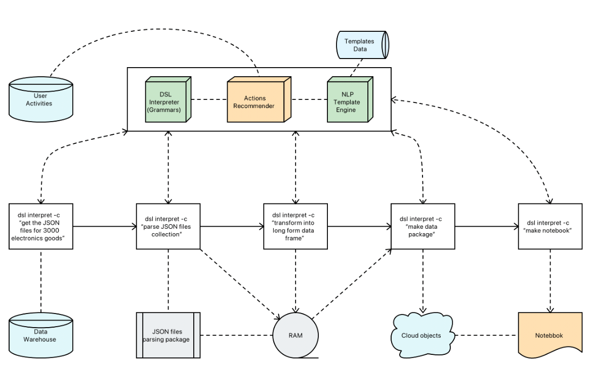

(The [NLP Template Engine](https://github.com/antononcube/NLP-Template-Engine) has its own repository, [AAr4].)

The chain of commands above:	

1. Parses and interprets the natural language commands

    1. And produces, say, JSON or XML records that have executable code.

1. Gets the commodities files from some default location

    1. Might ask for credentials.

1. Uses some JSON parsing package in some programming language to make the long form data frame

1. Makes a data package with the long form data frame

    1. Python and R data packages are regular packages.

    1. WL data package can be a resource function or resource object.

1. Uploads the data package in some repository

    1. Local packages installation folder or a private cloud.

1. Creates a notebook and populates with command(s) loading the data package

1. Opens the notebook in some notebook interpreter.

    1. Jupyter notebooks can be opened in a Web browser or VSCode.

    1. R notebooks, in IntelliJ or RStudio

    1. WL/Mathematica notebooks, in Mathematica

---

## Example commands and dialogs

We have to gather or make commands and dialogs for such a system.  

Here are examples:

```mathematica
lsExampleCommands = 
   {"recommend customer service data that has product descriptions", 
    "what data can I get for time series investigations?;why did you recommend those", 
    "I want to investigate data that cross references good purchases with customer demographics;keep only datasets that can be transformed to star schema", "verify the quality of the database dbGJ99;what fraction of records have missing data;what are the distributions of the numerical columns", 
    "how many people used customer service data last month;what is the breakdown of data sources over data types;where textual data is utilized the most;plot the results;", 
    "what data people like me acquired last month;which of those I can use for classfier investigations;show me the data sizes and metadata;"};
lsExampleCommands2 = Map[StringRiffle[StringTrim /@ StringSplit[#, ";"], "\n"] &, lsExampleCommands];
Multicolumn[lsExampleCommands2, 2, Dividers -> All]
```

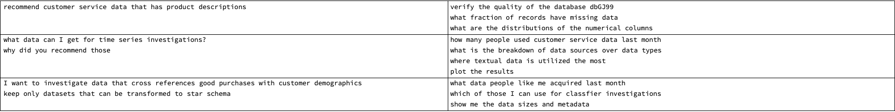

---

## General design

```mathematica
aCAComponents = <|
    "Data Acquisition Engine" -> Import["https://raw.githubusercontent.com/antononcube/Data-Acquisition-Engine-project/main/Diagrams/Data-Acquisition-Workflows-design.jpg"], 
    "Sous Chef Susana" -> Import["https://raw.githubusercontent.com/antononcube/ConversationalAgents/master/Projects/SousChefSusana/Diagrams/Sous-Chef-Susana-design.jpg"], 
    "Head Huntress Gemma" -> Import["https://github.com/antononcube/ConversationalAgents/raw/master/Projects/HeadHuntressGemma/Diagrams/Head-Huntress-Gemma-design.jpg"] 
   |>;
aCAComponents["Data Acquisition Engine"]
```

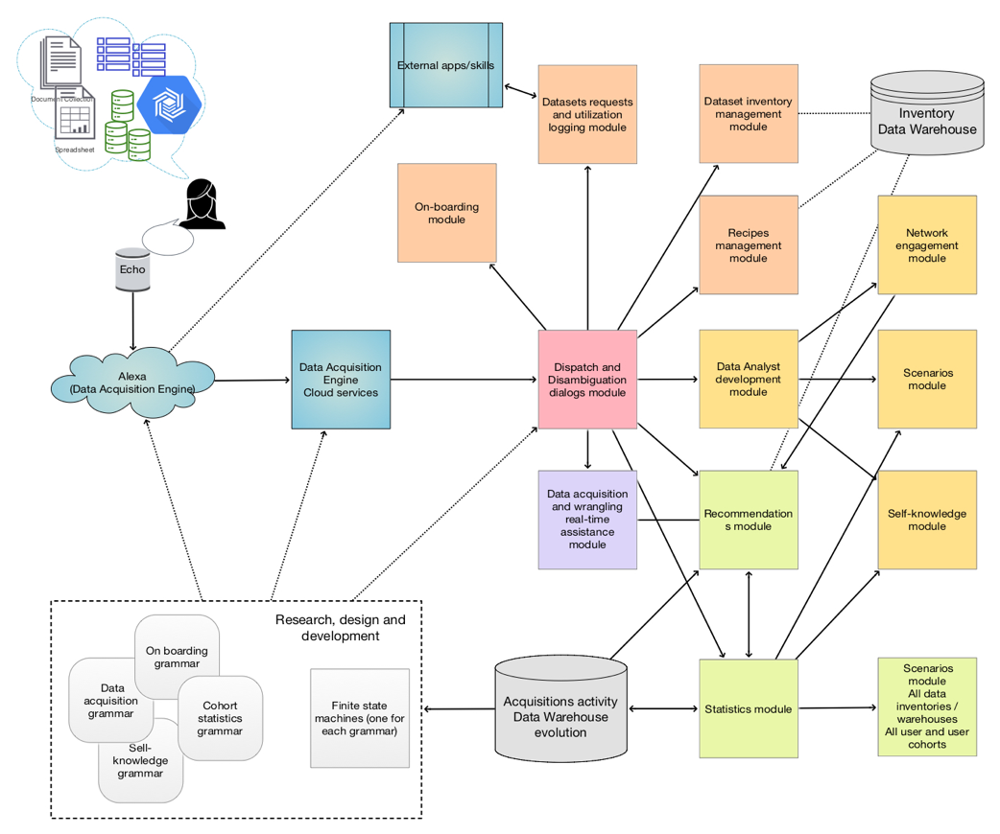

---

## Similar conversational agents

### Tab view

```mathematica
TabView[Show[ImageCrop@#, ImageSize -> 1200] & /@ aCAComponents]
```

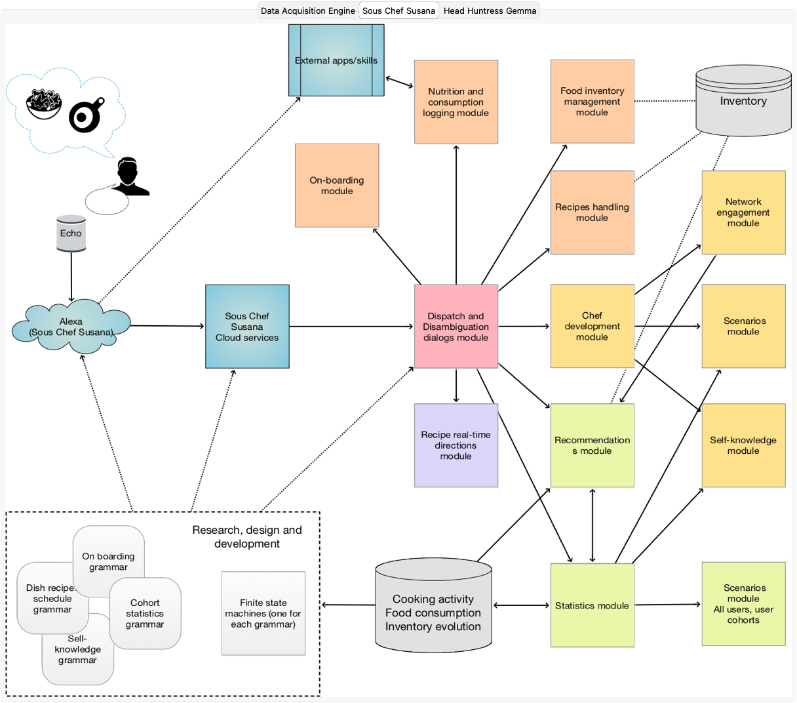

### All diagrams

```mathematica
aCAComponents
```

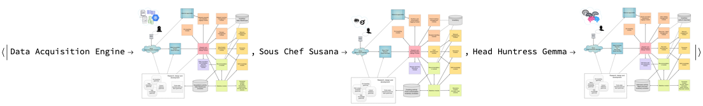

---

## Similar conversational agents (cont.)

#### Food preparation workflows (Sous Chef Susana)

DSL MODULE FoodPrep; 
what did we eat last twelve months

```mathematica
ResourceFunction["RecordsSummary"][dsSCSMeals[Select[AbsoluteTime[DateObject["2020-08-01"]] <= AbsoluteTime[#Timestamp] <= AbsoluteTime[DateObject["2021-08-08"]] &]]]
```

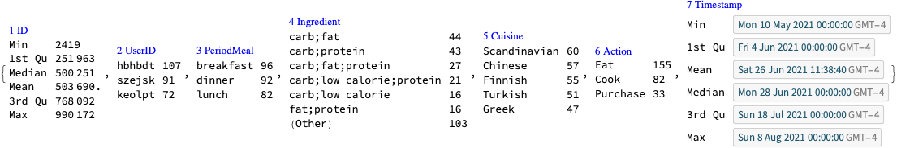

#### Recruiting workflows (Head Huntress Gemma)

DSL MODULE Recruiting; 
recommend job descriptions for java

```mathematica
smrHHGJobs ⟹ SMRMonRecommendByProfile[ {"Skill:java"}] ⟹ SMRMonJoinAcross["Warning"->False] ⟹ SMRMonTakeValue[]
```

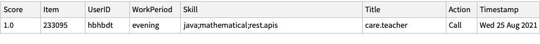

---

## Multi-language in both senses

The Data Acquisition Workflows Conversational Agent (CA) is part of a bigger effort: CAs for computational workflows.

The system is designed to translate multiple natural DSLs into multiple programming DSLs:

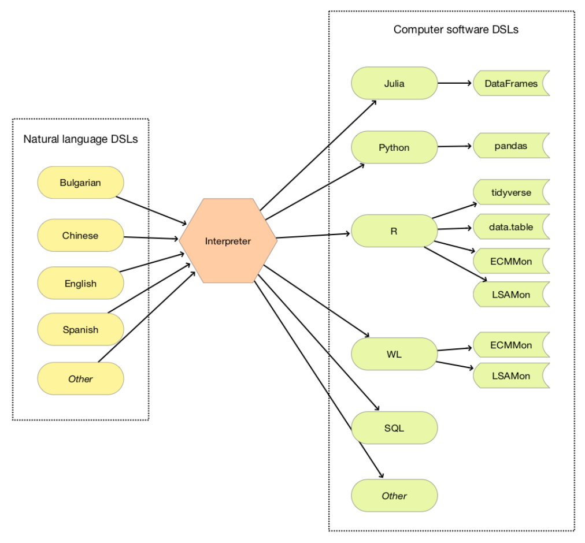

Note that the interpreter can be made with WL, [Raku](https://raku.org), and/or other relevant systems.

---

##  Data wrangling demo

... from last year.

Here are data wrangling examples that support the statements above:

```mathematica
commands = "use dfStarwars; rename homeworld as HW and age as HOWOLD;group by species; counts;";
```

```mathematica
aRes = Association@Map[# -> ToDataQueryWorkflowCode[commands, "Target" -> #, "Execute" -> False, "StringResult" -> True] &, {"Julia-DataFrames", "Python-pandas", "R-base", "R-tidyverse", "Spanish", "WL-System"}];
```

```mathematica
ResourceFunction["GridTableForm"][List @@@ Normal[aRes]]
```

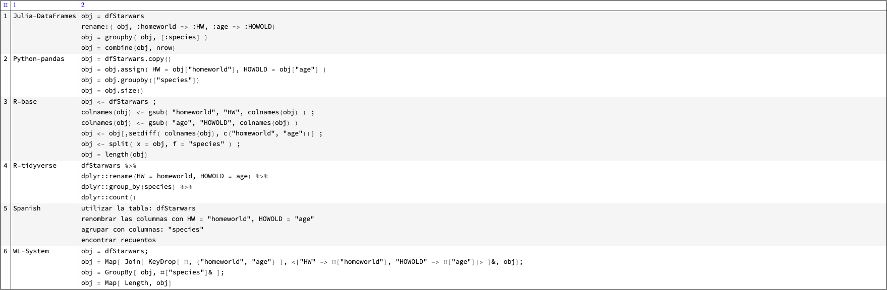

**Remark:** Shorter code is produced for dedicated data wrangling packages. (As expected.)

See this interactive interface : https://antononcube.shinyapps.io/DSL-evaluations/

---

## Data wrangling demo (cont.)

**From last year, **WTC-2020**, ["Multi-language Data-Wrangling Conversational Agent"](https://www.youtube.com/watch?v=pQk5jwoMSxs)**

### Tabular data transformation workflows

Here is a flow chart that shows the targeted workflows:

```mathematica
plWorkflows = ImageCrop@Import["https://github.com/antononcube/ConversationalAgents/raw/master/ConceptualDiagrams/Tabular-data-transformation-workflows.jpg"]
```

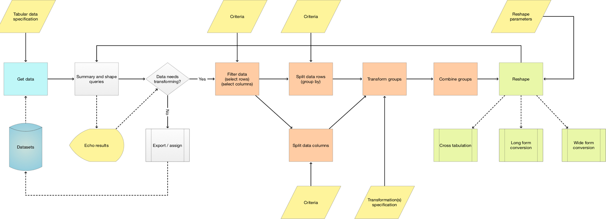

Only the data loading and summary analysis are not optional. (The left-most diagram elements.)

All other steps are optional.

**Remark:** The Split-Transform-Combine pattern (orange blocks) is implemented in [ParallelCombine](http://reference.wolfram.com/mathematica/ref/ParallelCombine.html).

Also, see the article ["The Split-Apply-Combine Strategy for Data Analysis"](https://www.jstatsoft.org/article/view/v040i01) by Hadley Wickham, [[HW1](https://www.jstatsoft.org/article/view/v040i01)].

---

## Conversational agents breakdown

First let us discuss Conversational Agents (CAs) in general.

```mathematica
plCABreakdown = ImageCrop@Import["https://github.com/antononcube/ConversationalAgents/raw/master/ConceptualDiagrams/Conversational-agents-breakdown.jpg"]
```

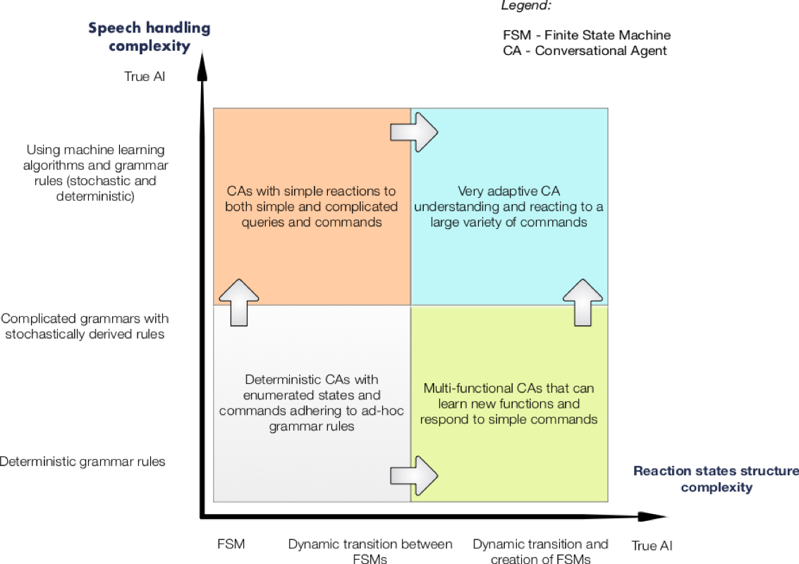

---

## Computational Conversational Agents Design (generic)

Here is a generic CA architecture:

```mathematica
plCAFrameBased = Import["https://github.com/antononcube/ConversationalAgents/raw/master/ConceptualDiagrams/Frame-based-conversational-agent-flowchart.jpg"]
```

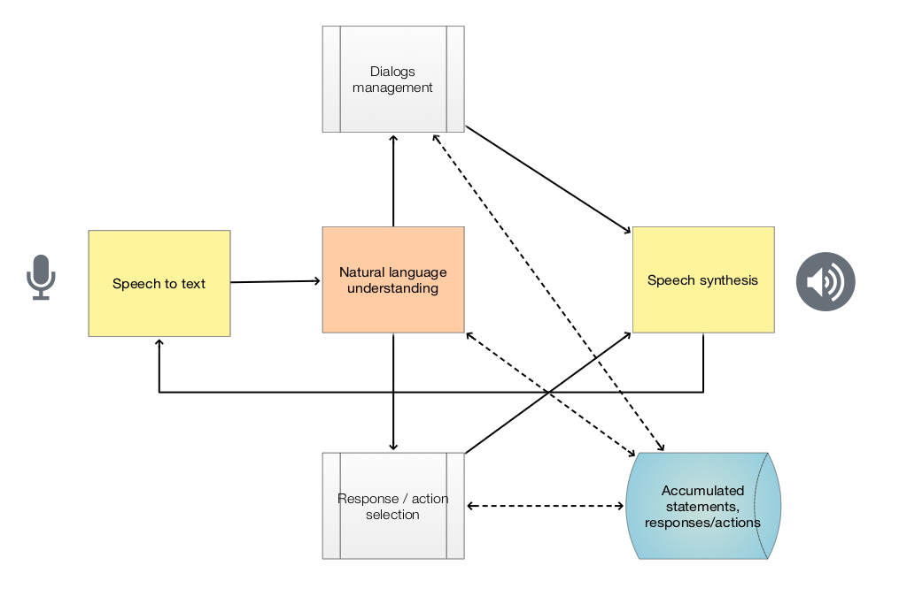

---

## Computational Conversational Agents Design

This diagram shows the framework of my current efforts:

```mathematica
plCAMonadic = Import["https://github.com/antononcube/ConversationalAgents/raw/master/ConceptualDiagrams/Monadic-making-of-ML-conversational-agents.jpg"]
```

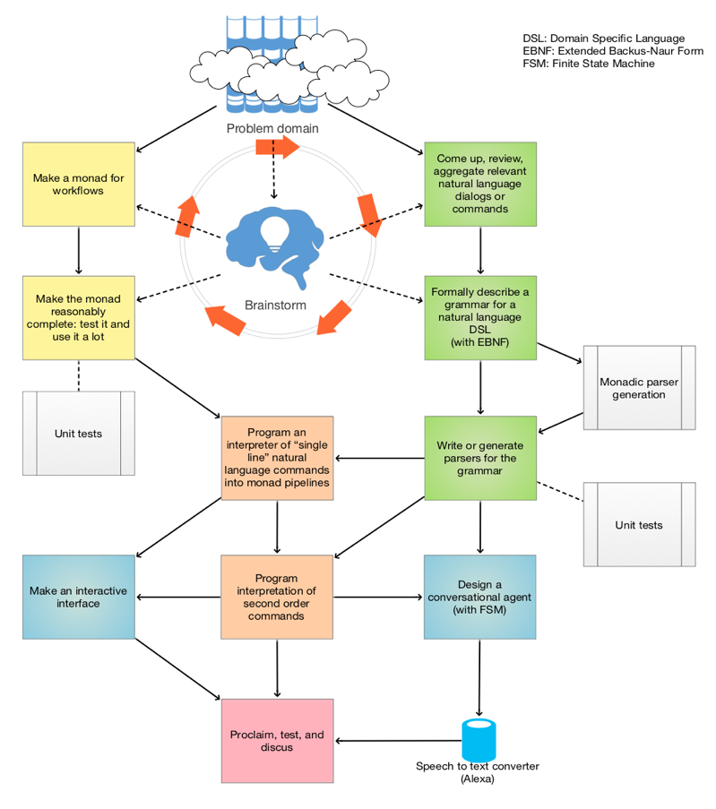

---

## Using Finite State Machines 

Basically, we move within states of a Finite State Machine (FSM) using different natural language commands interpreters.

Here is an example (from the project [OOPDataAcquisitionDialogsAgent](https://github.com/antononcube/ConversationalAgents/tree/master/Projects/OOPDataAcquisitionDialogsAgent)):

```mathematica
Import["https://raw.githubusercontent.com/antononcube/ConversationalAgents/master/Projects/OOPDataAcquisitionDialogsAgent/Mathematica/OOPDataAcquisitionDialogsAgent.m"]
```


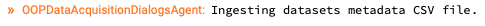

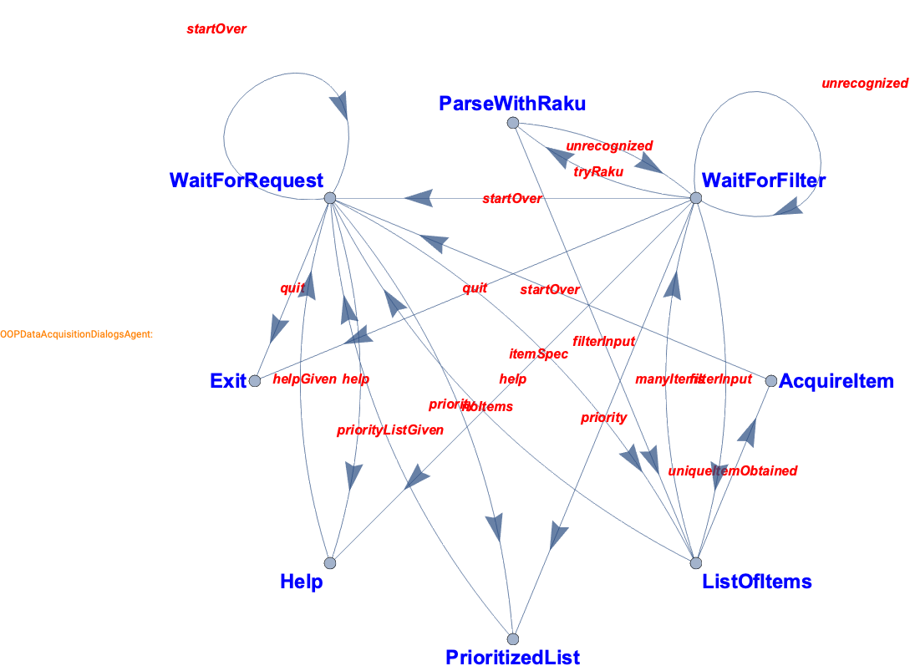

---

## Using Finite State Machines (cont.)

This FSM execution over a sequence of commands corresponds to design UNIX-pipeline design shown above:

```mathematica
daObj["Run"["WaitForRequest", {"get a dataset from Statistics", "", "the one with 31 rows", "", "the second", "", "", "quit"}]]
```


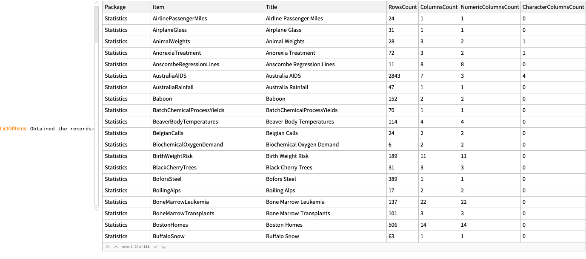


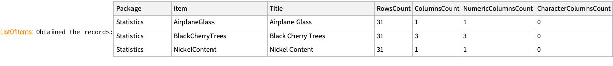


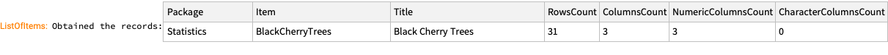

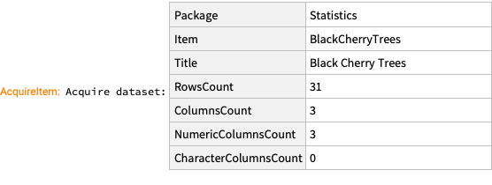


```mathematica
daDataObject

(*{{8.3, 70, 10.3}, {8.6, 65, 10.3}, {8.8, 63, 10.2}, {10.5, 72, 16.4}, {10.7, 81, 18.8}, {10.8, 83, 19.7}, {11, 66, 15.6}, {11, 75, 18.2}, {11.1, 80, 22.6}, {11.2, 75, 19.9}, {11.3, 79, 24.2}, {11.4, 76, 21}, {11.4, 76, 21.4}, {11.7, 69, 21.3}, {12, 75, 19.1}, {12.9, 74, 22.2}, {12.9, 85, 33.8}, {13.3, 86, 27.4}, {13.7, 71, 25.7}, {13.8, 64, 24.9}, {14, 78, 34.5}, {14.2, 80, 31.7}, {14.5, 74, 36.3}, {16, 72, 38.3}, {16.3, 77, 42.6}, {17.3, 81, 55.4}, {17.5, 82, 55.7}, {17.9, 80, 58.3}, {18, 80, 51.5}, {18, 80, 51}, {20.6, 87, 77}}*)
```

The FSM execution above creates a WFR notebook (with automatic file name and automatically filled-in sections):

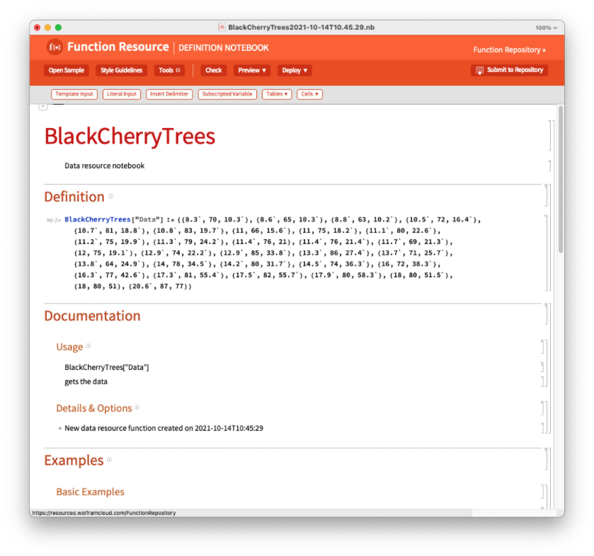

---

## Data acquisition system components

The following mind-maps shows the data acquisition system components:

```mathematica
plGeneralDAWMindMap = Import["https://github.com/antononcube/Data-Acquisition-Engine-project/raw/main/Diagrams/Data-Acquisition-Workflows-mind-map.png"]
```

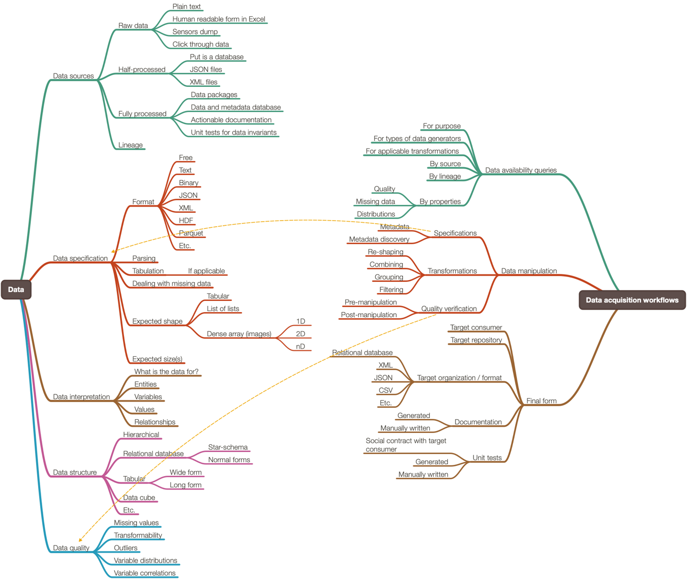

---

## Data acquisition conversational agent components

Here is a mind-map Data Acquisition Conversational Agent (CA) components:

```mathematica
plDAWCAMindMap = Import["https://github.com/antononcube/Data-Acquisition-Engine-project/raw/main/Diagrams/Data-Acquisition-Workflows-Conversational-Agent-Modules-mind-map.png"]
```

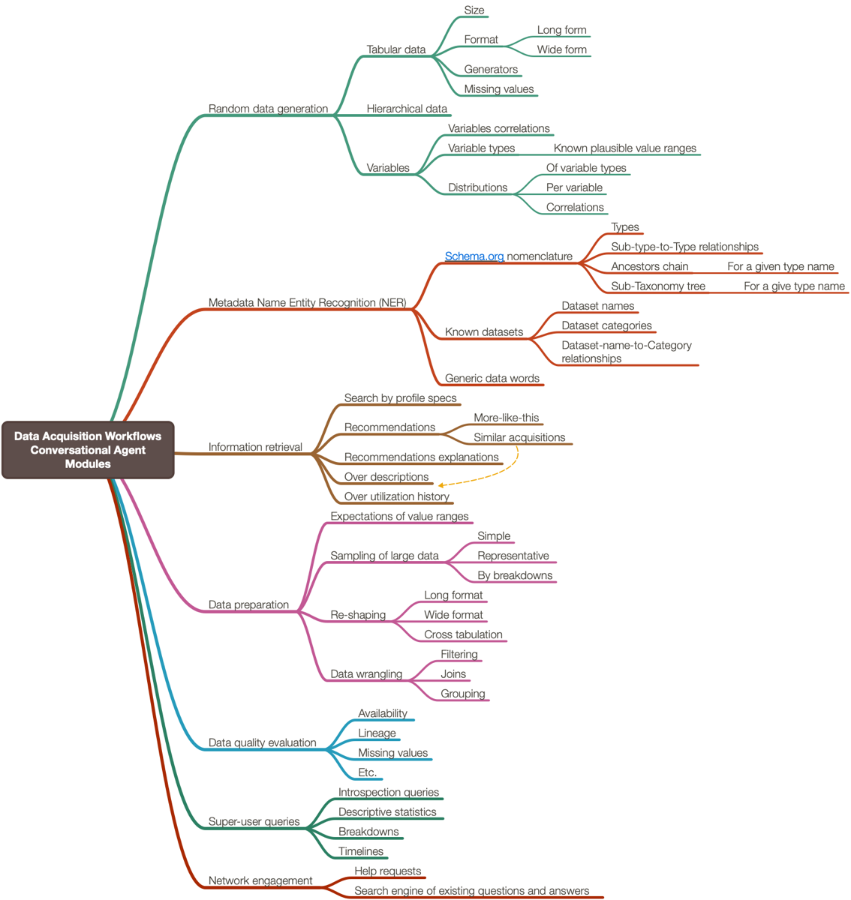

---

## Clothes have no emperor

We use the principle “Clothes have no emperor”, we want Data Acquisition Conversational Agents to be have the minimum required awareness of the data:

```mathematica
plDAWComponents = ImageCrop@Import["https://github.com/antononcube/Data-Acquisition-Engine-project/raw/main/Diagrams/Data-Acquisition-Workflows-components-interaction.png"]
```

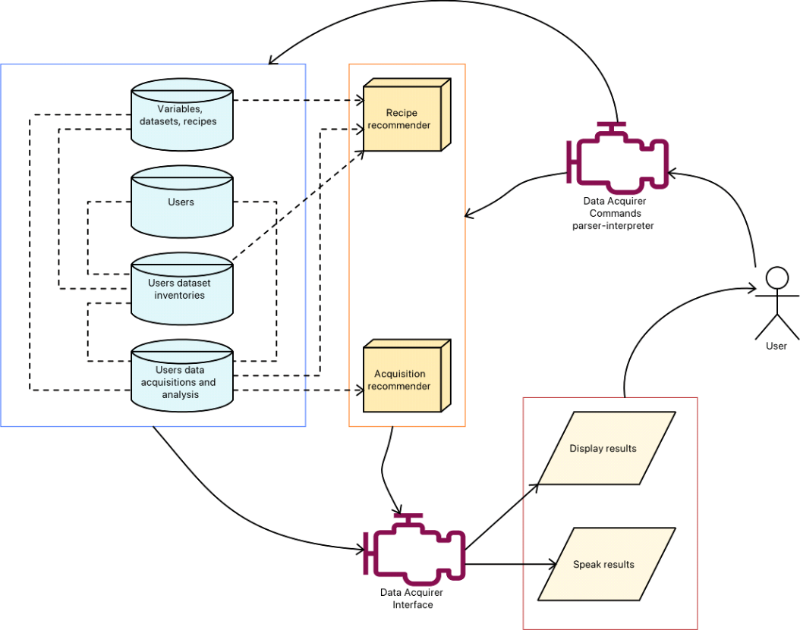

---

## Random data generation

There is a dedicated WFR function [RandomTabularDataset](https://resources.wolframcloud.com/FunctionRepository/resources/RandomTabularDataset/).

### DSL mode

DSL DataAcquisition; generate a random dataset with ten rows and three columns and with 20 max number of values

```mathematica
ResourceFunction["RandomTabularDataset"][{10, 3}, "MaxNumberOfValues" -> 20]
```

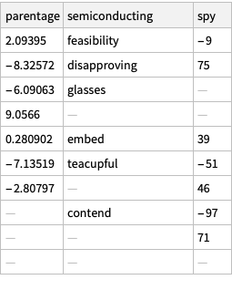

```mathematica
ResourceFunction["RandomTabularDataset"][{10, 3}, "MaxNumberOfValues" -> 20]
```

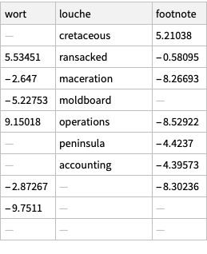

```mathematica

```

### NLP Template Engine

```mathematica
Concretize["Make some random table with 10 rows, with 3 columns, and with maximum of 20 values", PerformanceGoal -> "Speed"]

(*Hold[ResourceFunction["RandomTabularDataset"][{10, 3}, "ColumnNamesGenerator" -> 3, "Form" -> "Wide", "MaxNumberOfValues" -> 20, "MinNumberOfValues" -> 20, "RowKeys" -> False]]*)
```

```mathematica
ReleaseHold[%]
```


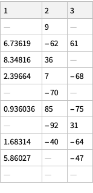

### Through Raku external evaluator

```perl6
use DSL::Shared::Utilities::ComprehensiveTranslation;

(*"(Any)"*)
```

```perl6
ToDSLCode("DSL MODULE DataAcquisition; generate a random dataset with 20 rows and 3 columns", defaultTargetsSpec=>'WL')

(*"{CODE => ResourceFunction[\"RandomTabularDataset\"][{20, 3}], COMMAND => DSL MODULE DataAcquisition; generate a random dataset with 20 rows and 3 columns, DSL => DSL::English::DataAcquisitionWorkflows, DSLFUNCTION => proto sub ToDataAcquisitionWorkflowCode (Str $command, Str $target = \"WL-System\", |) {*}, DSLTARGET => WL-System, USERID => }"*)
```

### Through a web service

```mathematica
command = "generate a random dataset with 10 rows and 3 columns and with 20 max number of values";
```

```mathematica
ColumnForm@DSLWebServiceInterpretation[command]
```

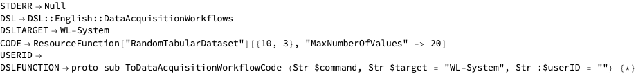


Consider the metadata: https://schema.org/ .

(The data is taken from the GitHub repository: https://github.com/schemaorg/schemaorg .)

```mathematica
dsAllHTTPSTypes = ResourceFunction["ImportCSVToDataset"]["https://raw.githubusercontent.com/schemaorg/schemaorg/main/data/releases/12.0/schemaorg-all-https-types.csv"]
```

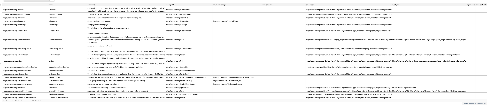


## Metadata 2

Here is the corresponding graph:

```mathematica
lsEdges = Map[DirectedEdge[FileNameSplit[#id][[-1]], If[StringQ[#subTypeOf] && Length[FileNameSplit[#subTypeOf]] > 0, FileNameSplit[#subTypeOf][[-1]], #subTypeOf]] &, Normal@dsAllHTTPSTypes];
lsSplitEntities = SplitWordsByCapitalLetters /@ Union[Flatten[List @@@ lsEdges]];
grAllTypes = Graph[lsEdges, VertexLabels -> "Name", ImageSize -> 2000, EdgeShapeFunction -> "CurvedEdge", EdgeStyle -> Arrowheads[Medium]]
```

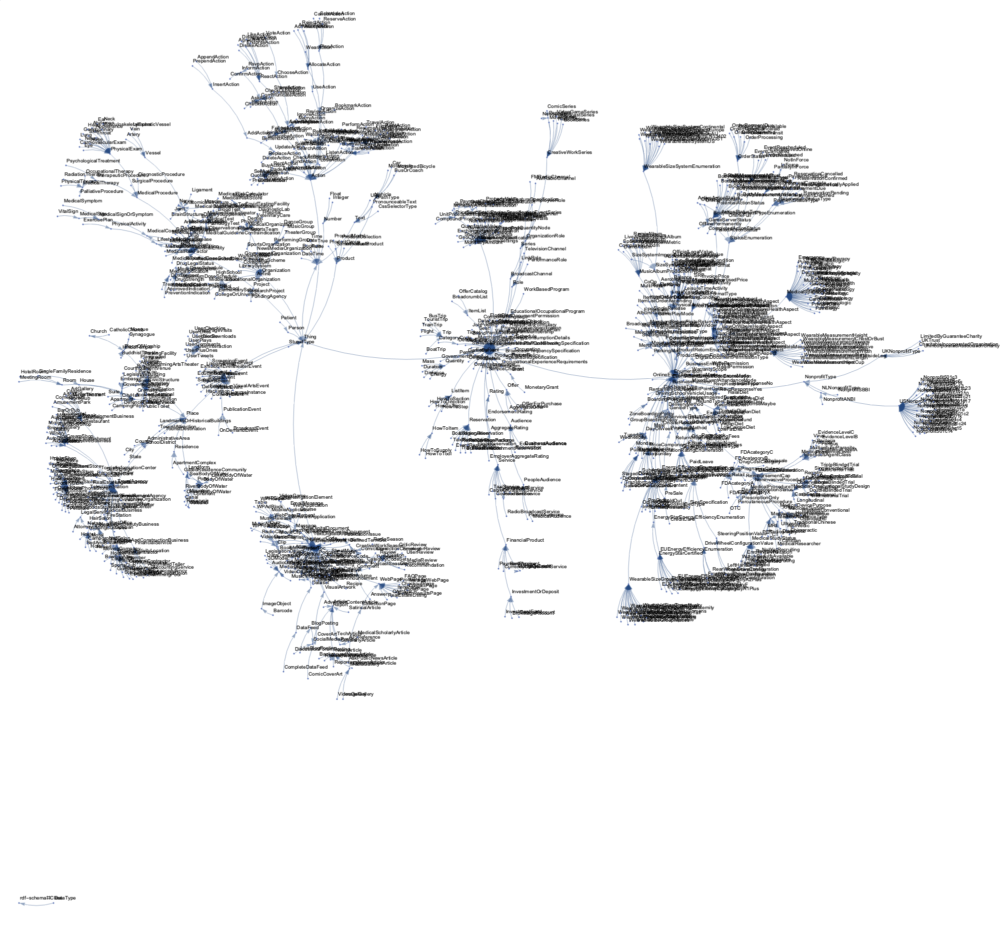

---

## Metadata Name Entity Recognition

Consider the retrieval and recognition of metadata entities using the following Raku code.  

```perl6
use DSL::Entity::Metadata;
use Data::Reshapers;

(*"(Any)"*)
```

```perl6
my $pCOMMAND = DSL::Entity::Metadata::Grammar;
say $pCOMMAND.parse(‘datte time’, rule => ‘metadata-entity-command’);

(*"#ERROR: Possible misspelling of 'date time' as 'datte time'.｢datte time｣entity-metadata-name => ｢datte time｣0 => ｢datte time｣word-value => ｢datte｣word-value => ｢time｣"*)
```

```perl6
my @testCommands = ('Titanic','time series','numerical', 'star schema', 'bike store');

my @targets = ('WL-Entity', 'WL-System');

my @tbl =
        gather {
            for @testCommands -> $c {
                for @targets -> $t {
                    my $start = now;
                    my $res = ToMetadataEntityCode($c, $t);
                    my $timing = now - $start;
                    take %( command => $c, target => $t, :$timing, parsed => $res)
                }
            }
        };

say to-pretty-table(@tbl.sort({ $_<command> }));

(*"#ERROR: Possible misspelling of 'stair' as 'star'.
#ERROR: Possible misspelling of 'stair' as 'star'.
+-------------+------------------------------------------+-----------+-------------+
|    timing   |                  parsed                  |   target  |   command   |
+-------------+------------------------------------------+-----------+-------------+
|  0.02409893 | ExampleData[{\"MachineLearning-Titanic\"}] | WL-Entity |   Titanic   |
| 0.017991533 |        \"MachineLearning-Titanic\"         | WL-System |   Titanic   |
| 0.010275244 |               \"BikeStore\"                | WL-Entity |  bike store |
| 0.014633144 |               \"BikeStore\"                | WL-System |  bike store |
| 0.030889434 |               \"Numerical\"                | WL-Entity |  numerical  |
|  0.03042332 |               \"Numerical\"                | WL-System |  numerical  |
| 0.039460255 |               \"StarSchema\"               | WL-Entity | star schema |
| 0.042105008 |               \"StarSchema\"               | WL-System | star schema |
| 0.045164041 |               \"TimeSeries\"               | WL-Entity | time series |
| 0.042830785 |               \"TimeSeries\"               | WL-System | time series |
+-------------+------------------------------------------+-----------+-------------+"*)
```

---


Try out [this interactive interface ](https://antononcube.shinyapps.io/ExampleDatasetsRecommenderInterface/)that uses a recommender objects over example datasets.

### “Common” recommender

The recommender’s items are two types: (1) datasets, and (2) columns of datasets.

That principle allows to find dataset similarities and “opportunistic joins.”

### Recommendation by profile

Recommendation by profile (i.e. search engine):

```mathematica
smrWLExampleData\[DoubleLongRightArrow]
  SMRMonRecommendByProfile[{"DataType:TimeSeries", "ApplicationArea:Finance"}, 6]\[DoubleLongRightArrow]
  SMRMonJoinAcross[dsWLExampleData, "ID"]\[DoubleLongRightArrow]
  SMRMonTakeValue[]
```

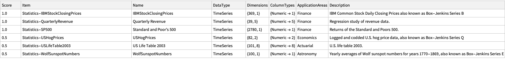

### Retrieve by query elements

Assume that we want to find time series datasets that have “financial data” in their descriptions, but are not with application areas “actuarial” and “aviation”, and do not have “categorical” data:

```mathematica
dsRes = 
   smrWLExampleData\[DoubleLongRightArrow]
    SMRMonRetrieveByQueryElements[
     "Should" -> {"Word:financial", "Word:data"}, 
     "Must" -> {"DataType:TimeSeries"}, 
     "MustNot" -> {"ApplicationArea:Actuarial", "ApplicationArea:Aviation", "ColumnType:Categorical"}]\[DoubleLongRightArrow]
    SMRMonJoinAcross[dsWLExampleData, "ID"]\[DoubleLongRightArrow]
    SMRMonTakeValue[];
```

```mathematica
ResourceFunction["RecordsSummary"][dsRes[All, ToString /@ # &]]
```

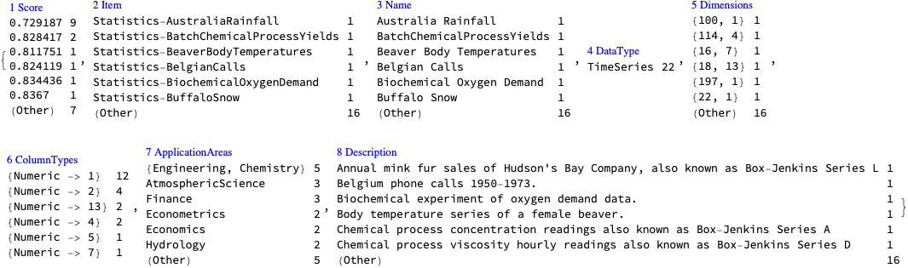

### Recommendation by history

Recommend datasets based on previous “dataset consumption”:

```mathematica
smrWLExampleData\[DoubleLongRightArrow]
  SMRMonRecommend[{"Statistics-USLifeTable2003", "Statistics-UKLungDiseaseDeaths"}, 8, "RemoveHistory" -> False]\[DoubleLongRightArrow]
  SMRMonJoinAcross[dsWLExampleData, "ID"]\[DoubleLongRightArrow]
  SMRMonTakeValue[]
```

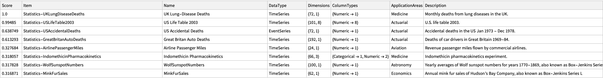

Note that the history is not removed.

--------

## Dataset recommender making 2

### Dataset data gathering

#### In Wolfram Language

#### In R

Using the data frame of R-packages datasets from ["Rdatasets"](https://vincentarelbundock.github.io/Rdatasets/). 

### Metadata unification

- Data identifiers

- Column types

- Including dataset descriptions

    - LSA application

    - Annexing

### Recommender representation

```mathematica
Map[MatrixPlot[#, ImageSize -> {Automatic, 250}] &, smrWLExampleData\[DoubleLongRightArrow]SMRMonTakeMatrices]
```

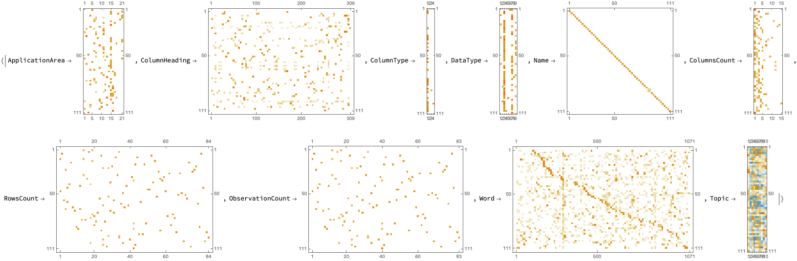

---

## [Example datasets interactive interface](https://antononcube.shinyapps.io/ExampleDatasetsRecommenderInterface/)

Try out [this interactive interface ](https://antononcube.shinyapps.io/ExampleDatasetsRecommenderInterface/)that uses a recommender objects over example datasets.

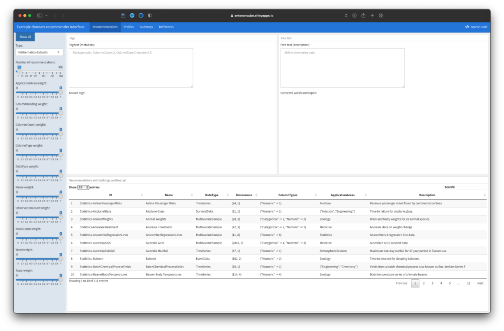

---

## Introspection commands

```perl6
use DSL::English::DataAcquisitionWorkflows

(*"(Any)"*)
```

```perl6
say ToDataAcquisitionWorkflowCode("how many times I acquired anatomical structure data last year", format =>'hash')

(*"{CODE => Length[dsDataAcquisitions[Select[AbsoluteTime[DateObject[\"2020-01-01\"]] <= AbsoluteTime[#Timestamp] <= AbsoluteTime[DateObject[\"2020-12-31\"]]&]]]}"*)
```

DSL MODULE DataAcquisitionWorkflows; DSL TARGET WL::System; how many times I acquired anatomical structure data last year

```
(*<|"DSLFUNCTION" -> "proto sub ToDataAcquisitionWorkflowCode (Str $command, Str $target = \"WL-System\", |) {*}", "DSLTARGET" -> "WL::System", "DSL" -> "DSL::English::DataAcquisitionWorkflows", "COMMAND" -> "DSL MODULE DataAcquisitionWorkflows; DSL TARGET WL::System; how many times I acquired anatomical structure data last year", "USERID" -> "", "CODE" -> ""|>*)
```

---

## Scaling over size and complexity

There are two principle ways to scale the MVP version of the data acquisition workflow functionalities:

- Large data sizes

- Automatic discovery of inter-relationship between datasets

---

## Large data

Consider the following data warehouses or storage services:

- Amazon Web Services S3

- Google Cloud Storage

- BigQuery

A few questions to answer implementation-wise:

- What are the ingredients of data packages for *accessing* the large data?

    - Using the data itself is not option.

- How representative samples of the data are taken and used?

- Where the “data scientist environment” is created?

---

## Opportunistic joins

Assume we have a fairly large set of datasets and we want to recommend possible (inner, left, or right) joins between small subsets of them.

1. Find types and distributions of all variables (dataset columns)

    1. Say, with FindDistrbution

1. Find variables pairs for which:

    1. The distributions are similar (according to some test)

    1. All values of  one subset of the other

1. Try to confirm correlations using other “signals”

    1. E.g. dataset descriptions and column descriptions.

1. Propose "opportunistic joins” to the user

---

## Opportunistic joins (cont.)

Let us illustrate with a set of random tabular datasets.

#### Generate a few random datasets

```mathematica
SeedRandom[222];
```

```mathematica
GetDists[] := {PoissonDistribution[RandomReal[{2, 19}]], NormalDistribution[RandomReal[{-3, 3}], RandomReal[{0.2, 12}]], SkewNormalDistribution[RandomReal[{-3, 10}], RandomReal[{0, 10}], RandomReal[{-3, -3}]]}
```

```mathematica
aRandomTables = Association@Table[
    StringReplace[ResourceFunction["RandomPetName"][], {" " -> "-", "\"" -> ""}] ->
     ResourceFunction["RandomTabularDataset"][
      {RandomInteger[{30, 190}], 3}, 
      "Generators" -> RandomChoice[GetDists[], 3] 
     ], 3]
```

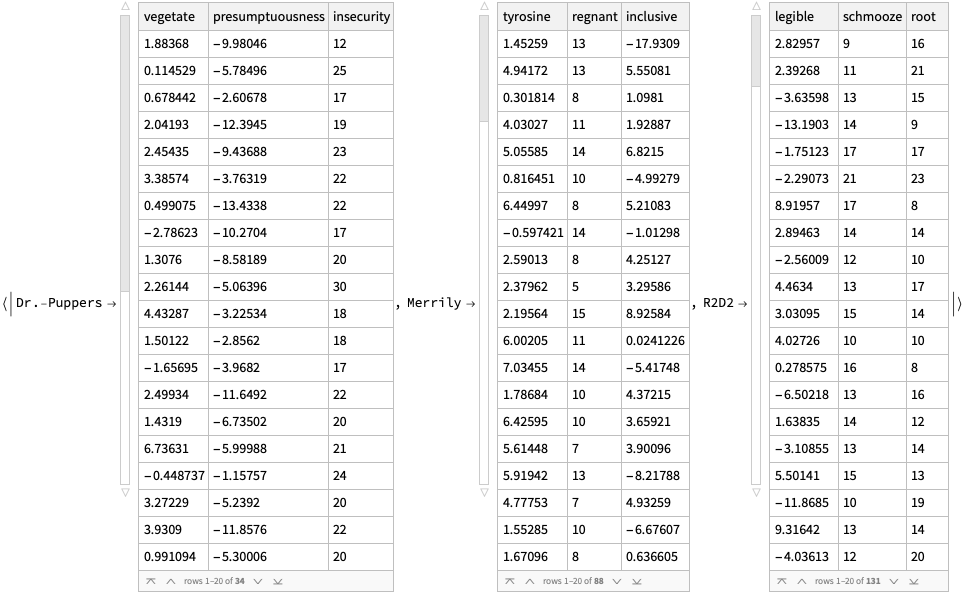

#### Convert to long format

```mathematica
aLongFormTables = ResourceFunction["LongFormDataset"] /@ aRandomTables;
```

```mathematica
aLongFormTables
```

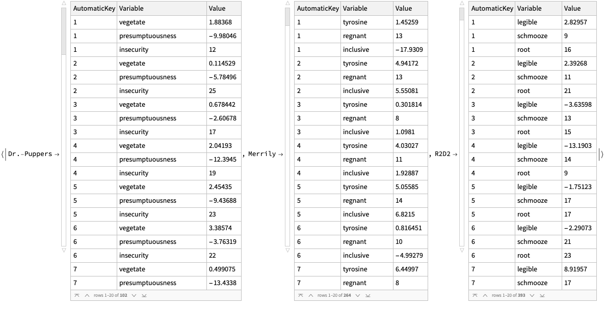

```mathematica
lsLongFormTables2 = KeyValueMap[Function[{k, v}, v[All, Join[<|"Dataset" -> k, "AutomaticKey" -> k <> "-" <> ToString[#AutomaticKey]|>, #] &]], aLongFormTables];
lsLongFormTables2
```

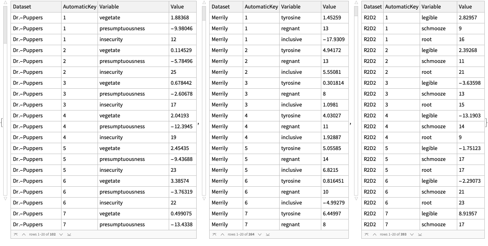

#### All tables together

```mathematica
dsAllTables3 = Join @@ lsLongFormTables2
```

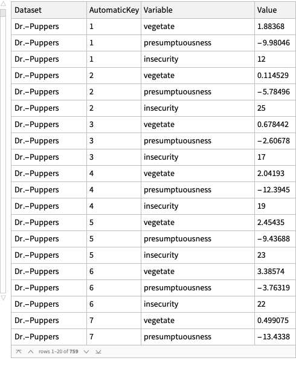

#### Find distributions for each dataset-variable pair

```mathematica
aColumnDistributions = GroupBy[Normal@dsAllTables3, {#Dataset, #Variable} &, FindDistribution[N[#Value & /@ #]] &]

(*<|{"Dr.-Puppers", "vegetate"} -> NormalDistribution[1.73168, 2.29172], {"Dr.-Puppers", "presumptuousness"} -> MixtureDistribution[{0.61888, 0.38112}, {UniformDistribution[{-14.4596, -0.5788}], NormalDistribution[-4.12577, 1.00474]}], {"Dr.-Puppers", "insecurity"} -> NormalDistribution[19.9122, 4.30093], {"Merrily", "tyrosine"} -> NormalDistribution[1.77683, 5.14717], {"Merrily", "regnant"} -> PoissonDistribution[10.7667], {"Merrily", "inclusive"} -> NormalDistribution[0.593115, 5.57807], {"R2D2", "legible"} -> NormalDistribution[-1.94072, 7.48967], {"R2D2", "schmooze"} -> PoissonDistribution[13.7218], {"R2D2", "root"} -> PoissonDistribution[13.4361]|>*)
```

#### Nearest neighbors

```mathematica
k = 50;
nnFunc = Nearest[Keys[aColumnDistributions] -> All, DistanceFunction -> (1 - DistributionFitTest[RandomVariate[aColumnDistributions[#1], k], aColumnDistributions[#2]] &)]
```

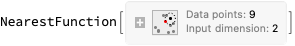

```mathematica
Keys[aColumnDistributions][[1]]
nnFunc[Keys[aColumnDistributions][[1]], 3]

(*{"Dr.-Puppers", "vegetate"}*)

(*{<|"Element" -> {"Dr.-Puppers", "vegetate"}, "Index" -> 1, "Distance" -> 0.330113|>, <|"Element" -> {"Merrily", "tyrosine"}, "Index" -> 4, "Distance" -> 0.99953|>, <|"Element" -> {"Merrily", "inclusive"}, "Index" -> 6, "Distance" -> 0.999975|>}*)
```

#### Nearest neighbors graph

```mathematica
NearestNeighborGraph[Keys[aColumnDistributions], DistanceFunction -> (1 - DistributionFitTest[RandomVariate[aColumnDistributions[#1], k], aColumnDistributions[#2]] &), VertexLabels -> "Name"]
```

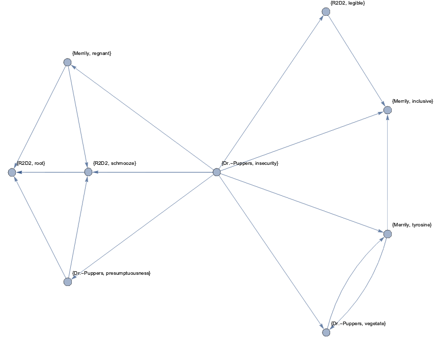

---

## How the parsing and interpreting are done?

Three kinds of parsing and interpreting are used.

### Native WL grammar

```mathematica
Import["https://raw.githubusercontent.com/antononcube/ConversationalAgents/master/Projects/OOPDataAcquisitionDialogsAgent/Mathematica/DataAcquisitionDialogsGrammar.m"]
```

```mathematica
DADCommandsGrammar[]

(*
<dad-command> = <dad-request-command> | <dad-filter> ;
<dad-request-command> = <dad-global> | <dad-preamble> &> <dataset-spec> | ( 'find' | 'put' | 'get' | 'obtain' ) &> <dataset-spec> <& ( ( 'on' | 'in' | 'to' ) , 'the' , <dad-environment> ) ;
<dad-preamble> = 'procure' | 'obtain' | 'i' , ( 'wanna' | 'want' , 'to' ) , ( 'investigate' | 'work' ) , 'with' | 'get' | 'find' ;
<dataset-spec> = [ 'the' | 'a' | 'an' ] &> ( <dad-package> , [ <dad-from-package> ] ) | <dad-title> | { <dad-title> } | ( [ 'some'  |  'a' ] , <dataset-phrase> ) &> <dad-from-package> ;
<dad-title> = '_LetterString' <@ DADTitle[#]& ;
<dad-package> = '_LetterString' <@ DADPackage[#]& ;
<dad-from-package> = ( 'from' | 'of' ) &> '_LetterString' <@ DADFromPackage[#]& ;
<dad-filter> = <dad-global> | [ <dad-preamble> ] &> ( <dad-list-pos-spec> | <dad-filter-package> | <dad-filter-occupation> , [ <dad-from-package> ] | <dad-filter-row-size> | <dad-filter-nrow> | <dad-filter-col-size> | <dad-filter-ncol> | <dad-title> | { <dad-title> } ) ;
<dad-filter-package> =  ( ( 'it' | 'that' ) , 'is' ) &> <dad-from-package>  | [ 'the' , 'one' ] &> <dad-from-package>  ;
<dad-filter-occupation> = ( [ <dad-preamble> ] | [ ( 'it' | 'that' ) , 'is' ] , [ 'from' | 'in' ] , ( 'a' | 'an' | 'the' ) ) &> <dad-package> ;
<dad-filter-row-size> = [ 'the' ] &> ( 'larger' | 'largest' | 'shorter' | 'shortest' ) <& [ 'one' ] <@ DADNRowSize[#]& ;
<dad-filter-nrow> = ( [ 'the' ] , [ 'one' ] , [ 'that' ] , [ 'has' | 'is' , 'with' ] , [ 'with' ] ) &> '_?IntegerQ' <& ( [ 'number' , 'of' ] , 'rows' , [ 'one' ] ) <@ DADNRow[#]& ;
<dad-filter-col-size> = [ 'the' ] &> ( 'wider' | 'widest' | 'narrower' | 'narrowest' ) <& [ 'one' ] <@ DADNColSize[#]& ;
<dad-filter-ncol> = ( [ 'the' ] , [ 'one' ] , [ 'that' ] , [ 'has' | 'is' , 'with' ] , [ 'with' ] ) &> '_?IntegerQ' <& ( [ 'number' , 'of' ] , 'columns' , [ 'one' ] ) <@ DADNCol[#]& ;
<dad-list-pos-spec> = [ 'the' ] &> ( <dad-list-num-pos> | 'last' | 'former' | 'later' ) <& ( [ 'one' ] | [ [ 'one' ] , 'in' , 'the' , 'list' ] ) <@ ListPosition[#]& ;
<dad-list-num-pos> = 'first' | 'second' | 'third' | 'fourth' | 'fifth' | 'sixth' | 'seventh' | 'eighth' | 'ninth' | 'tenth' | 'Range[1,100]' ;
<dad-usage-spec>  = 'my' , 'next' , <data-analysis-phrase> | 'the' , <data-analysis-phrase> , [ 'i' , 'have' , 'now' ] ;
<dad-global> = <dad-global-help> | <dad-global-cancel> | <dad-global-priority-list> ;
<dad-global-help> = 'help' <@ DADGlobal[help]& ;
<dad-global-cancel> = 'start' , 'over' | 'cancel' <@ DADGlobal[cancel]& ;
<dad-global-priority-list> = 'priority' , ( 'order' | 'list' ) | 'order' , 'by' , 'priority' <@ DADGlobal[priority]& ;
<dataset-phrase> = 'dataset' | [ 'data' ] , 'table' | [ 'tabular' ] , 'data' ;
<data-analysis-phrase> = <dataset-phrase> , [ 'investigation' | 'analysis' | 'research' ] ;
<dad-environment> = 'environment' | 'notebook' ;
*)
```

```mathematica
Multicolumn[Union@GrammarRandomSentences[GrammarNormalize[DADCommandsGrammar[]], 12], 3]
```

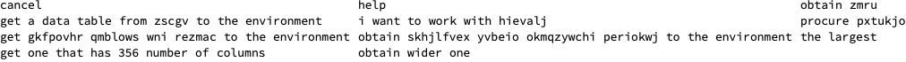

### Raku grammars

```perl6
use DSL::Shared::Utilities::ComprehensiveTranslation;
say ToDSLCode(“filter with Package is ‘Statistics’ and Title starts with ‘air’”)

(*"{
    CODE => dplyr::filter(Package == \"Statistics\" & grepl( pattern = \"^air\", x = Title)), 
    COMMAND => filter with Package is "Statistics" and Title starts with "air", 
    DSL => DSL::English::DataQueryWorkflows, 
    DSLFUNCTION => proto sub ToDataQueryWorkflowCode (Str $command, Str $target = \"tidyverse\", |) {*}, 
    DSLTARGET => R-tidyverse, 
    USERID => }"*)
```

```perl6
say ToDSLCode(“filter with Package is ‘Statistics’ and Title starts with ‘air’”):ast
```

```
{CODE => ｢filter with Package is 'Statistics' and Title starts with 'air'｣
 workflow-command => ｢filter with Package is 'Statistics' and Title starts with 'air'｣
  filter-command => ｢filter with Package is 'Statistics' and Title starts with 'air'｣
   filter => ｢filter ｣
    filter-verb => ｢filter｣
   filter-spec => ｢Package is 'Statistics' and Title starts with 'air'｣
    predicates-list => ｢Package is 'Statistics' and Title starts with 'air'｣
     predicate => ｢Package is 'Statistics' and Title starts with 'air'｣
      predicate-sum => ｢Package is 'Statistics' and Title starts with 'air'｣
       predicate-product => ｢Package is 'Statistics' and Title starts with 'air'｣
        predicate-term => ｢Package is 'Statistics' ｣
         predicate-simple => ｢Package is 'Statistics' ｣
          predicate-value => ｢Package ｣
           mixed-quoted-variable-name => ｢Package｣
            variable-name => ｢Package｣
          lhs => ｢Package ｣
           mixed-quoted-variable-name => ｢Package｣
            variable-name => ｢Package｣
          predicate-relation => ｢is ｣
           equal-relation => ｢is｣
          predicate-value => ｢'Statistics' ｣
           mixed-quoted-variable-name => ｢'Statistics'｣
            quoted-variable-name => ｢'Statistics'｣
             single-quoted-variable-name => ｢'Statistics'｣
              variable-ws-name => ｢Statistics｣
          rhs => ｢'Statistics' ｣
           mixed-quoted-variable-name => ｢'Statistics'｣
            quoted-variable-name => ｢'Statistics'｣
             single-quoted-variable-name => ｢'Statistics'｣
              variable-ws-name => ｢Statistics｣
        and-operator => ｢and｣
        predicate-term => ｢Title starts with 'air'｣
         predicate-simple => ｢Title starts with 'air'｣
          predicate-value => ｢Title ｣
           mixed-quoted-variable-name => ｢Title｣
            variable-name => ｢Title｣
          lhs => ｢Title ｣
           mixed-quoted-variable-name => ｢Title｣
            variable-name => ｢Title｣
          predicate-relation => ｢starts with ｣
           like-start-relation => ｢starts with｣
          predicate-value => ｢'air'｣
           mixed-quoted-variable-name => ｢'air'｣
            quoted-variable-name => ｢'air'｣
             single-quoted-variable-name => ｢'air'｣
              variable-ws-name => ｢air｣
          rhs => ｢'air'｣
           mixed-quoted-variable-name => ｢'air'｣
            quoted-variable-name => ｢'air'｣
             single-quoted-variable-name => ｢'air'｣
              variable-ws-name => ｢air｣, 
              COMMAND => filter with Package is 'Statistics' and Title starts with 'air', 
              DSL => DSL::English::DataQueryWorkflows, 
              DSLFUNCTION => proto sub ToDataQueryWorkflowCode (Str $command, Str $target = "tidyverse", |) {*}, DSLTARGET => R-tidyverse, USERID => }
```

### NLP Template Completion

```mathematica
Import["https://raw.githubusercontent.com/antononcube/NLP-Template-Engine/main/Packages/WL/NLPTemplateEngine.m"]
```

```mathematica
Concretize["Make a random tabular dataset with 20 rows, 5 columns and no more than 40 values, and its form is long."]

(*Hold[ResourceFunction["RandomTabularDataset"][{20, 5}, "ColumnNamesGenerator" -> $Failed, "Form" -> "Wide", "MaxNumberOfValues" -> 40, "MinNumberOfValues" -> 40, "RowKeys" -> False]]*)
```

```mathematica
% // ReleaseHold
```

---

## Additional topics

### Prefix trees (Tries) with frequencies

Using Prefix Trees with Frequencies we can make frequency-based auto-completions and detect/correct misspellings.

### Numeric word forms

```mathematica
SeedRandom[7732];
MapThread[#1 -> IntegerName[#1, {#2, "Words"}] &, {RandomInteger[{0, 1200}, 5], {"Japanese", "Bulgarian", "Russian", "Spanish", "English"}}]

(*{642 -> "六百四十二", 787 -> "седемстотин осемдесет и седем", 749 -> "семьсот сорок девять", 800 -> "ochocientos", 609 -> "six hundred nine"}*)
```

```perl6
use Lingua::NumericWordForms;

(*"(Any)"*)
```

```perl6
from-numeric-word-form(["六百五十二","седемстотин осемдесет и седем",”семьсот сорок девять”,”ochocientos”,"six hundred nine"]):p

(*"(japanese => 652 bulgarian => 787 russian => 749 spanish => 800 english => 609)"*)
```

### Using FoxySheep and BearGoat (instead of WolfRam)

There is an impressive project named ["FoxySheep"](https://github.com/rocky/FoxySheep2) for translating WL to Python.

I want(ed) to have something similar that translates WL to [Raku](https://raku.org). 

I want to automate the translation of [data acquisition and wrangling unit tests written in WL](https://github.com/antononcube/ConversationalAgents/tree/master/UnitTests/WL).

Initially, I thought naming the project BearGoat, but then opted for something more easily understood, ["Mathematica::Grammar"](https://github.com/antononcube/Raku-Mathematica-Grammar).

Also, with this kind of grammar it would be easier to translate WL code to English; and from English to translate to other programming languages. 

### UNIX design similarities

---

## UNIX design similarities

- In many ways the presented philosophy and design resembles that of UNIX.

    - That statement can be seen as “appeal to authority”, but probably is going to introduce and clarify the “message” faster.

- Almost of all of [Eric Raymond's 17 Unix rules](https://en.wikipedia.org/wiki/Unix_philosophy) are adhered to:

```mathematica
Magnify[ResourceFunction["ImportCSVToDataset"]["https://raw.githubusercontent.com/antononcube/RakuForPrediction-book/main/Part-0-Introduction/R4P-vs-UnixRules.csv"], 1.4]
```

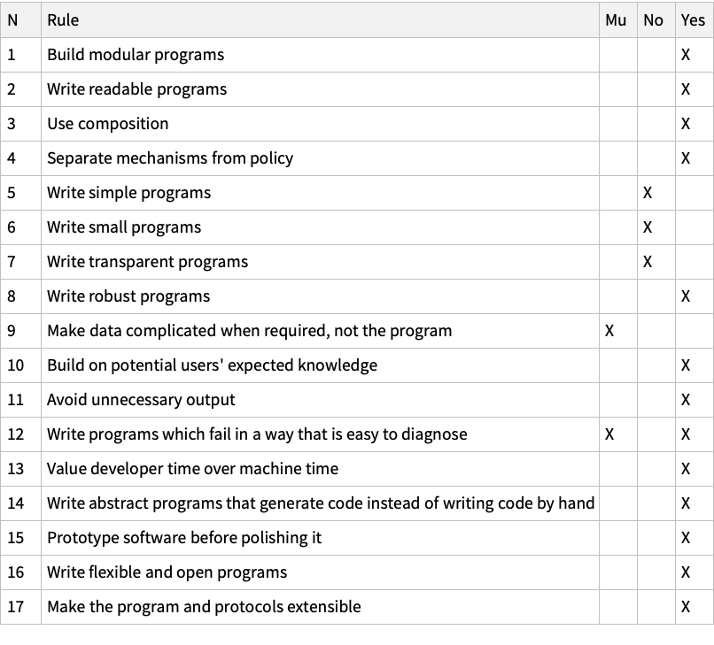

---

## Connecting Raku to notebooks

[Raku](https://www.raku.org) cells in DSLMode or RakuMode use an OS process of sandboxed [Raku](https://www.raku.org) through the library [ZeroMQ](https://zeromq.org).

Here is an infographic that summarizes my “journey” of implementing [Raku](https://www.raku.org) connections to Mathematica and [RStudio notebooks](https://rmarkdown.rstudio.com/lesson-10.html):

```mathematica
plMakingRakuConnections = Import["https://github.com/antononcube/RakuForPrediction-book/raw/main/Part-0-Introduction/Diagrams/Raku-hook-up-to-notebooks-journey.jpg"]
```

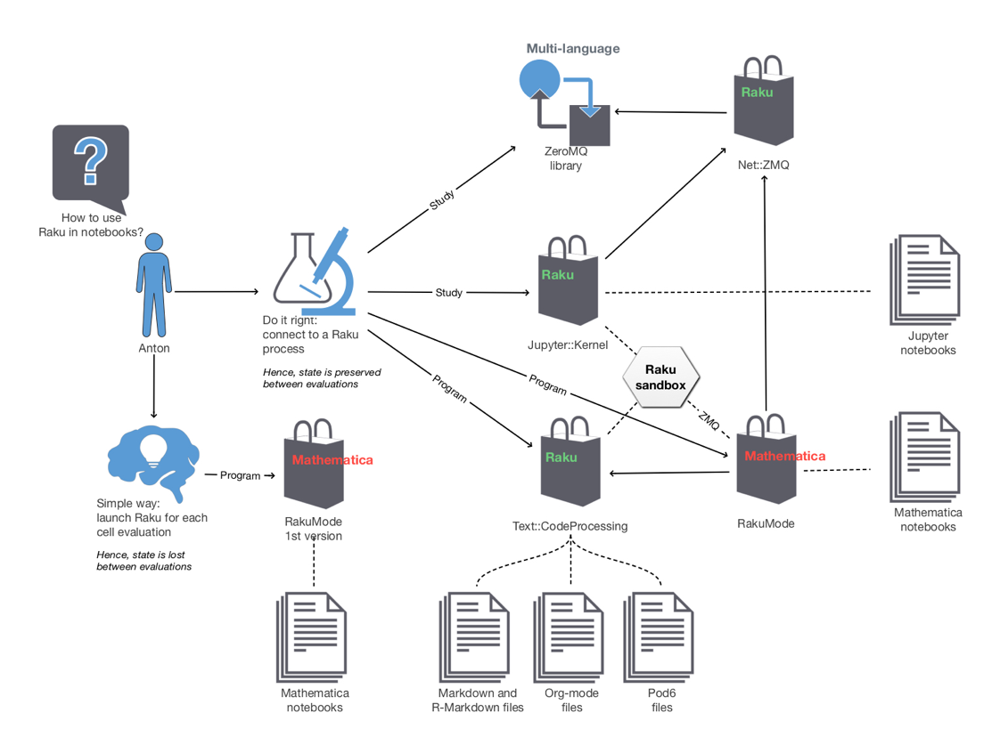

---

## The translation execution loop

In this notebook we use the following translation (parser-interpreter) execution loop:

```mathematica
plRakuExecutionLoop = Import["https://github.com/antononcube/RakuForPrediction-book/raw/main/Part-0-Introduction/Diagrams/Raku-execution-in-Mathematica-notebook.jpg"]
```

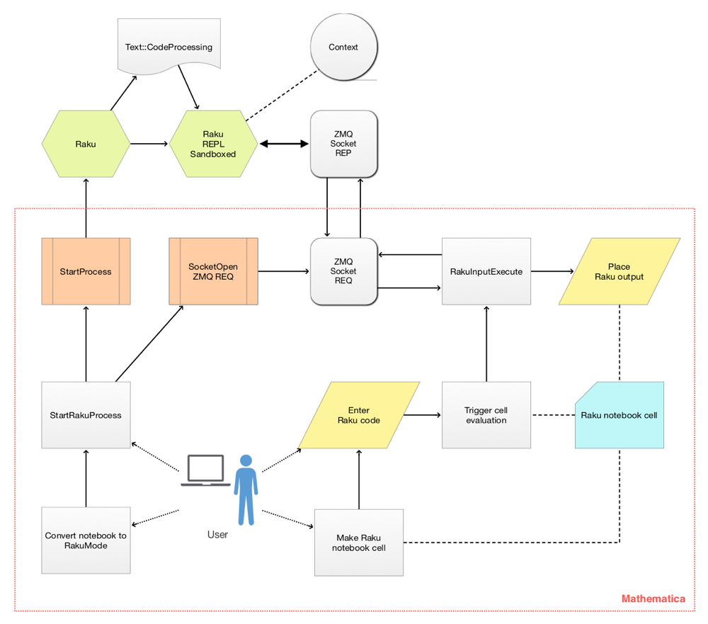

---

## Conclusion

To summarize the talk we use a different breakdown of the Data Acquisition Conversational Agent:

```mathematica
Import["https://github.com/antononcube/Data-Acquisition-Engine-project/raw/main/Diagrams/Data-acquisition-conversational-agent-breakdown-mind-map.png"]
```

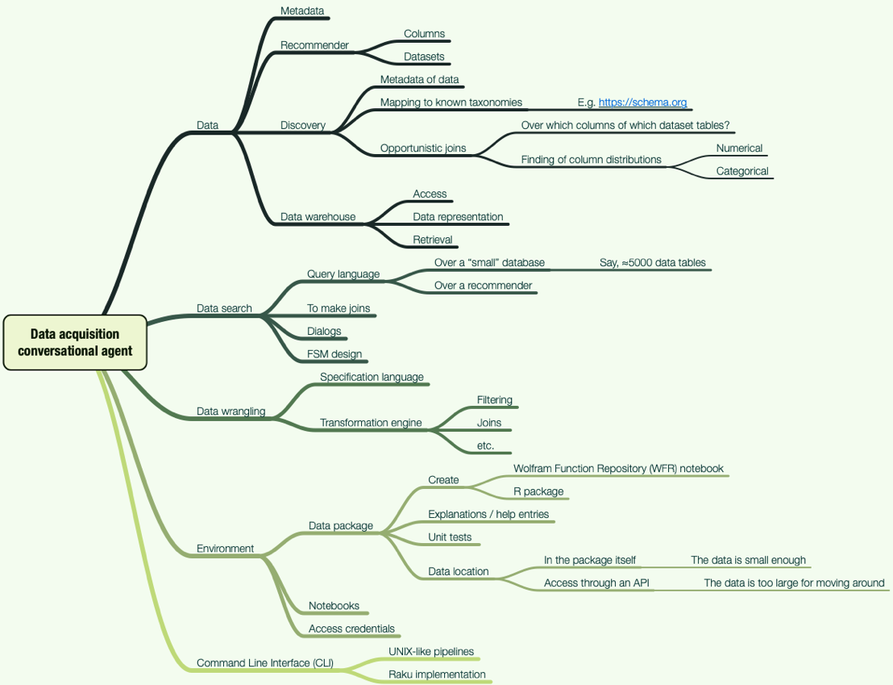

---

## Acknowledgements

### [Kuba Podkalicki](https://community.wolfram.com/web/kubapod)

WL notebooks to Markdown export ([M2MD](https://github.com/kubaPod/M2MD)). Notebook creation and manipulation. Notebook stylesheets and interactive features. 

### [Diego Zviovich](https://community.wolfram.com/web/dzviovich)

General discussions on data acquisition workflows and [ZeroMQ](https://zeromq.org).

---

## References

### Articles, movies

[AA1] Anton Antonov, ["How to simplify Machine learning workflows specifications? (useR! 2020)"](https://mathematicaforprediction.wordpress.com/2020/06/28/how-to-simplify-machine-learning-workflows-specifications-user-2020/), (2020), [MathematicaForPrediction at WordPress](https://mathematicaforprediction.wordpress.com).

[HW1] Hadley Wickham, ["The Split-Apply-Combine Strategy for Data Analysis"](https://www.jstatsoft.org/article/view/v040i01), (2011), [Journal of Statistical Software](https://www.jstatsoft.org).

### Repositories

[AAr1] Anton Antonov, [Data Acquisition Engine project](https://github.com/antononcube/Data-Acquisition-Engine-project), (2021), [GitHub/antononcube](https://github.com/antononcube).

[AAr2] Anton Antonov, [DSL::English::DataQueryWorkflows Raku package](https://github.com/antononcube/Raku-DSL-English-DataQueryWorkflows), (2020), [GitHub/antononcube](https://github.com/antononcube).

[AAr3] Anton Antonov, [DSL::English::DataAcquisitionWorkflows Raku package](https://github.com/antononcube/Raku-DSL-English-DataAcquisitionWorkflows), (2021), [GitHub/antononcube](https://github.com/antononcube).

[AAr4] Anton Antonov, [DSL::English::FoodPreparationWorkflows Raku package](https://github.com/antononcube/Raku-DSL-English-FoodPreparationWorkflows), (2021), [GitHub/antononcube](https://github.com/antononcube).

[AAr5] Anton Antonov, ["Raku for Prediction" book](https://github.com/antononcube/RakuForPrediction-book), (2021), [GitHub/antononcube](https://github.com/antononcube).

[AAr6] Anton Antonov, [NLP Template Engine](https://github.com/antononcube/NLP-Template-Engine), (2021), [GitHub/antononcube](https://github.com/antononcube).

[RS1] RStudio, [https://www.tidyverse.org](https://www.tidyverse.org).

[RS2] RStudio, [https://github.com/tidyverse](https://github.com/tidyverse).

### Interactive interfaces

Hosted at  [www.shinyapps.io](https://www.shinyapps.io).

[AAii1] [DSL evaluations](https://antononcube.shinyapps.io/DSL-evaluations/)

[AAii2] [FindTextualAnswer evaluations interface](https://antononcube.shinyapps.io/FindTextualAnswer-evaluations/)

[AAii3] [Example datasets recommender interface](https://antononcube.shinyapps.io/ExampleDatasetsRecommenderInterface/)

### Videos

[AAv1] Anton Antonov, [“Multi-language Data-Wrangling Conversational Agent”](https://www.youtube.com/watch?v=pQk5jwoMSxs), WTC-2020 presentation, (2020),[ Wolfram at YouTube](https://www.youtube.com/channel/UCJekgf6k62CQHdENWf2NgAQ).

[AAv2] Anton Antonov, ["useR! 2020: How to simplify Machine Learning workflows specifications (A. Antonov), lightning"](https://www.youtube.com/watch?v=b9Uu7gRF5KY), (2020), R Consortium at YouTube.

[AAv3] Anton Antonov, ["Raku for Prediction"](https://conf.raku.org/talk/157), (2021), The Raku Conference.

---

## Code

### NLP Template Engine

```mathematica
Import["https://raw.githubusercontent.com/antononcube/NLP-Template-Engine/main/Packages/WL/NLPTemplateEngine.m"]
```

### DSLMode

```mathematica
Import["https://raw.githubusercontent.com/antononcube/ConversationalAgents/master/Packages/WL/DSLMode.m"]
```

```mathematica
DSLMode[]
KillRakuProcess[]
StartRakuProcess[]
```

### SplitWordsByCapitalLetters

```mathematica
Clear[SplitWordsByCapitalLetters];
SplitWordsByCapitalLetters[word_String] := StringCases[word, CharacterRange["A", "Z"] ~~ (Except[CharacterRange["A", "Z"]] ...)];
SplitWordsByCapitalLetters[words : {_String ..}] := Map[SplitWordsByCapitalLetters, words];
```

### SplitWordAndNumber

```mathematica
Clear[SplitWordAndNumber];
SplitWordAndNumber[word_String] := If[StringMatchQ[word, (LetterCharacter ..) ~~ (DigitCharacter ..)], StringCases[word, x : (LetterCharacter ..) ~~ n : (DigitCharacter ..) :> x <> " " <> n], word];
```
